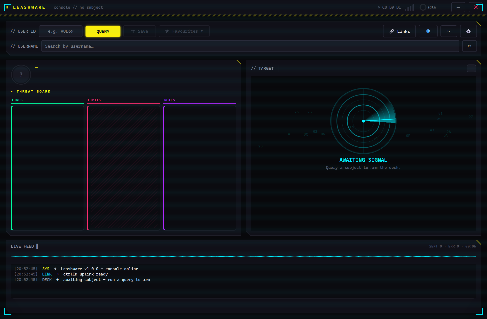
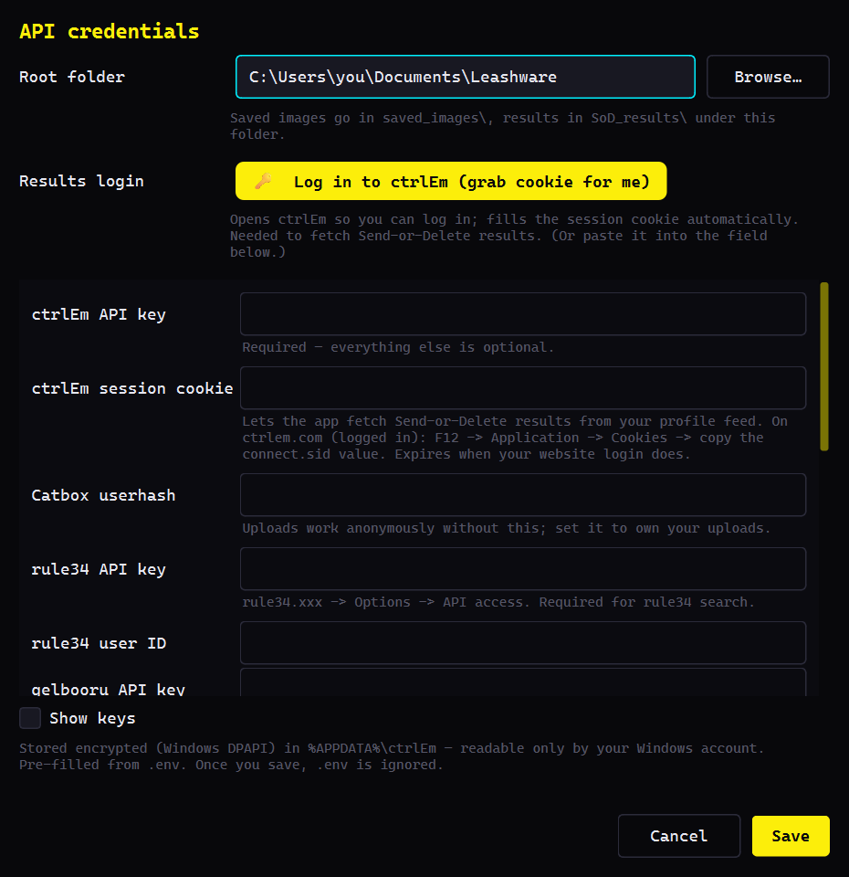

# Leashware

A CtrlEm helper client for Windows.

Leashware is a desktop app for [ctrlem.com](https://ctrlem.com). The website works fine, but if you send a lot of commands it gets tedious, so this exists: one window with the whole command deck (popup images, sounds, messages, screen blanks, wallpapers, PiShock/Lovense triggers and the rest), plus image search, batch sending, history and automatic censoring on top.

> ⚠️ **18+ only.** This is a tool for consensual adult play through the ctrlEm service, and some of the image sources it searches are adult sites.

## Getting started

Download `Leashware.exe` from the [latest release](../../releases/latest), put it wherever you like, run it. No installer.

You need Windows 10 or 11 and a ctrlEm account with an API key. Everything else is optional.

Since the exe isn't code-signed, the first launch will probably show a "Windows protected your PC" screen. Click *More info → Run anyway*. Some antivirus tools also side-eye PyInstaller apps in general, which is a known false-positive thing. If you'd rather not run a random unsigned binary from the internet: fair. Ask questions in the issues.

The app keeps itself up to date. On launch it checks this repo for a newer release, and if you accept, it downloads and verifies the new exe and swaps it in place. The new version runs *the next time you start the app*, not immediately. If you spot a `Leashware.exe.old` next to it after an update, that's normal and it cleans itself up.

## Setting up credentials

Open Settings and fill in what you have. Only the ctrlEm API key is actually required.

| Credential | What it's for |
|---|---|
| ctrlEm API key | Required. Everything below is optional. |
| ctrlEm session cookie | Fetching your Send-or-Delete results. The settings screen has a button that logs you in and grabs it for you, or copy `connect.sid` yourself (F12 → Application → Cookies on ctrlem.com). Expires when your website login does. |
| Catbox userhash | Uploads work anonymously without it; set it if you want the uploads tied to your catbox account. |
| rule34 API key + user ID | rule34 search. |
| gelbooru API key + user ID | gelbooru search. |
| e621 username + API key | Optional, e621 works anonymously. |
| danbooru username + API key | Optional. A Gold account raises the 2-tag search limit to 6. |
| Unsplash / Pexels / Pixabay keys | Extra stock-photo sources for the "For Real" picker. Openverse is built in and needs no key at all. |

Credentials are stored encrypted on your own machine (Windows DPAPI, in `%APPDATA%\ctrlEm\credentials.dat`) and only ever go to the service each key belongs to. DPAPI ties the file to your Windows account, so it can't be copied to another PC. You'd just re-enter your keys there.

## Features

The main window is the command console: query a subject, and the deck arms with every ctrlEm command, rate-limited and logged in the live feed at the bottom. The dossier panel next to it shows their profile, likes, limits and notes.

Beyond plain commands there's a fair bit of quality-of-life:

- An image picker that searches boorus (rule34, gelbooru, e621, danbooru) or stock-photo sites, with tag autocomplete, thumbnails, hover previews, and a straight path from search result to sent command.
- FLOOD: queue up a batch of images and send them back to back, optionally with a message first and a screen blank.
- Bulk upload a folder of files to catbox and collect the links.
- A history strip of everything you've sent, with thumbnails and one-click resend. Send-or-Delete entries show how they ended (kept or deleted) once the result lands on your profile feed.
- Automatic censoring. Before an image goes out, AI detection can paint over the body parts you pick, each with its own style: solid box, blur, pixelate, text bar or emoji. Two models run side by side, NudeNet for photos and a danbooru-trained detector for drawn art, since NudeNet alone is fairly blind on anime. You get a review screen before anything is sent, and if detection fails the send is blocked outright rather than letting an uncensored image slip through. Originals are never touched; censored copies go to their own folder.

The censoring ships with a small model. Settings offers one-click downloads of the full-size NudeNet model (~100 MB) and the anime detector (~45 MB), which are a lot more accurate and worth getting. They land in `%APPDATA%\ctrlEm\models\` and survive updates.

## Worth knowing

- Not a fan of all the glow and movement? The `〜` button in the top-right row (next to the gear) turns the animations off. It sticks across restarts, and the button turns yellow while reduced motion is active.
- The ctrlEm API rate-limits sends: one command per target every 3 seconds, at most 20 per minute overall. The app paces itself to stay inside those limits, so batches queue up on their own and you don't have to think about it.
- Uploads go to catbox.moe, and catbox links are public to anyone holding the URL. Don't send anything through the app that must never leave your machine.
- Everything the app stores lives in `%APPDATA%\ctrlEm\`: caches, history, credentials, models. Delete that folder for a factory reset.
- Catbox sometimes stores a blank file for no apparent reason. Uploads are verified and retried automatically, so at worst you'll see a retry in the feed.

## When something breaks

| Problem | Usual cause |
|---|---|
| Commands fail immediately | API key missing or wrong. Check Settings. |
| Send-or-Delete results stay pending | Session cookie expired. Log in again via the settings button. |
| A booru search returns nothing | That source needs its API key, see the table above. |
| Censoring blocks a send with an error | The detection model didn't load. Re-download the models in Settings. Blocking is deliberate: no detection, no send. |
| Update doesn't seem to apply | It applies on the next launch. Restart the app. |

Anything else: open an [issue](../../issues).

## About this repo

This repository only hosts the releases; the source lives in a separate private repo.

## License

Leashware is free to use as-is and will stay that way. It comes without warranty of any kind; you run it at your own risk. Please don't re-upload the exe elsewhere, link to this repo's releases instead. The source is not public.

If the app has been good to you, a coffee is always appreciated: [ko-fi.com/vulturif](https://ko-fi.com/vulturif).

Built with Qt / PySide6 (LGPL). Censoring is powered by [NudeNet](https://github.com/notAI-tech/NudeNet) and the [DeepGHS anime censor model](https://huggingface.co/deepghs/anime_censor_detection). Uploads are hosted by [catbox.moe](https://catbox.moe).
